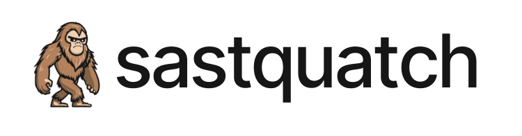

# Sastquatch
Sastquatch is a powerful yet simple static analysis tool that combines the strengths of CodeQL and Semgrep with custom rules, all packaged in a Docker container for easy deployment and use.


# Features
- Utilizes CodeQL for deep, semantic code analysis
- Incorporates Semgrep for fast, pattern-based scanning
- Custom rules tailored for enhanced security checks (50+ custom rules)
- Dockerized for consistent environments and easy setup
- Lightweight and efficient compared to more complex toolsets


# Getting Started

## Installing Sastquatch Engine
1. Clone this repository:
    ```bash
    git clone https://github.com/fazledyn/sastquatch
    ```

2. Build the Docker image:
    ```
    docker build -f Dockerfile -t sastquatch:latest .
    ```

# Usage
Run Sastquatch on your codebase:
```bash
docker run --rm -v /path/to/source:/workspace/source -v /path/to/result:/workspace/result -t codeql-container:dev --language LANGUAGE --queries QUERIES
```
`LANGUAGE` can be any of the below:
- `python`
- `javascript`

`QUERIES` can be any of the below:
- `code-scanning`
- `security-extended`
- `security-and-quality`


# License
This tool uses CodeQL CLI including the CodeQL engine which is hosted in a [different repository](https://github.com/github/codeql-cli-binaries) and is [licensed separately](https://github.com/github/codeql-cli-binaries/blob/main/LICENSE.md). If you'd like to use the CodeQL CLI to analyze closed-source code, you will need a commercial license; please [contact GitHub](https://github.com/enterprise/contact) for further help. **People are responsible for using it at their own.**


# Acknowledgments
- Inspired by the [OpenSSF Omega Analyzer](https://github.com/ossf/alpha-omega/tree/main/omega/analyzer)
- Built with CodeQL and Semgrep
